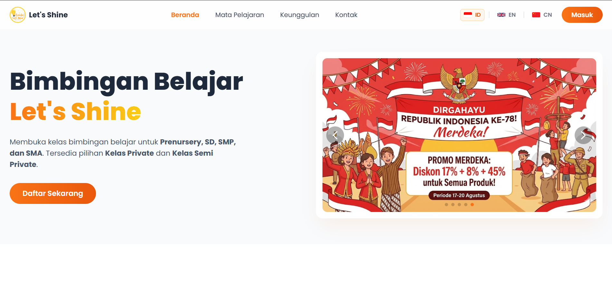
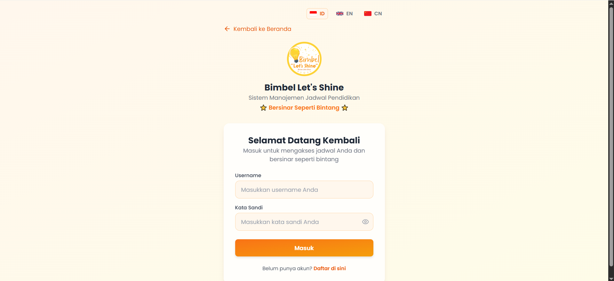
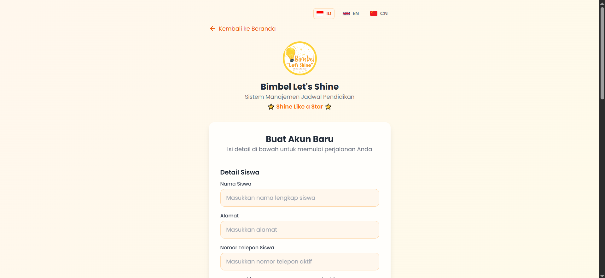
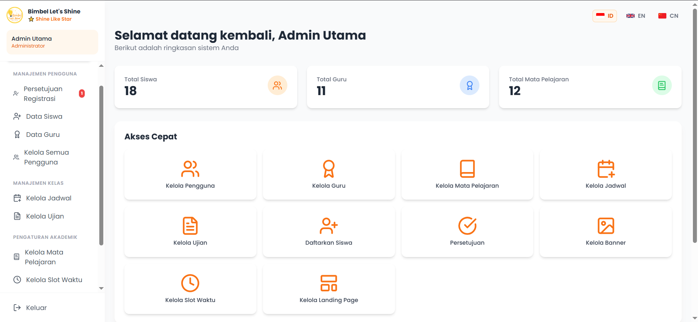
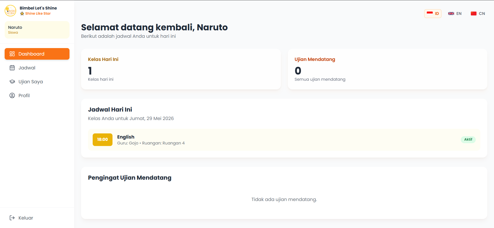
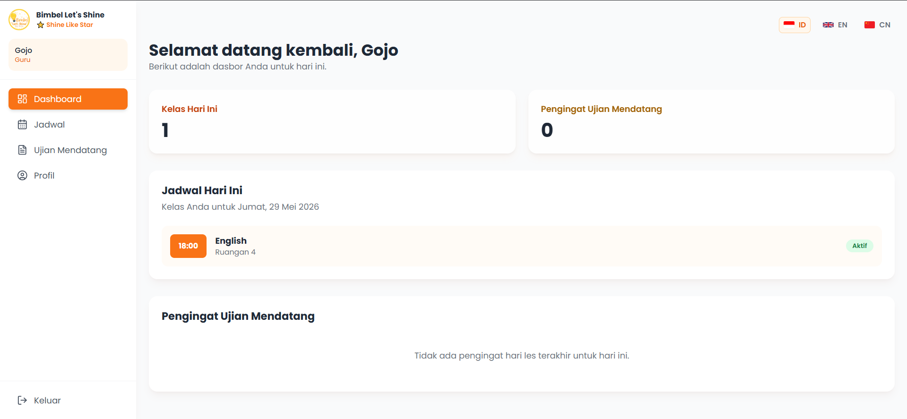

<p align="center">
  
</p>

<h1 align="center">🌟 Bimbel Let's Shine</h1>

<p align="center">
  <strong>Sistem Manajemen Bimbingan Belajar Berbasis Web</strong><br>
  <em>Web-Based Tutoring Center Management System</em>
</p>

<p align="center">
  
  
  
  
  
</p>

---

## 📖 Deskripsi

**Bimbel Let's Shine** adalah aplikasi web sistem manajemen bimbingan belajar (bimbel) yang dirancang untuk mempermudah pengelolaan kegiatan belajar mengajar di Bimbel Let's Shine, Batam Centre. Aplikasi ini menyediakan platform terpadu untuk admin, guru, dan siswa dalam mengelola jadwal, mata pelajaran, ujian, dan pendaftaran siswa baru.

### ✨ Fitur Utama

| Fitur | Deskripsi |
|-------|-----------|
| 🌐 **Multi-bahasa** | Mendukung 3 bahasa: Indonesia 🇮🇩, English 🇬🇧, dan 中文 🇨🇳 |
| 👤 **Multi-role Dashboard** | Dashboard terpisah untuk Admin, Guru, dan Siswa |
| 📅 **Manajemen Jadwal** | Kelola jadwal kelas berdasarkan hari, waktu, dan ruangan |
| 📝 **Pendaftaran Online** | Siswa dapat mendaftar secara online dengan sistem approval |
| 📊 **Manajemen Ujian** | Kelola jadwal dan data ujian siswa |
| 🎓 **Manajemen Mata Pelajaran** | CRUD mata pelajaran yang tersedia |
| 👩‍🏫 **Manajemen Guru** | Kelola profil dan jadwal mengajar guru |
| 📢 **Manajemen Banner** | Kelola banner/slider di halaman utama |
| ⏰ **Manajemen Slot Waktu** | Atur slot waktu belajar yang fleksibel |
| 🖥️ **Landing Page Dinamis** | Halaman utama yang kontennya dapat dikelola melalui admin |
| 📱 **Responsive Design** | Tampilan responsif untuk desktop dan mobile |

---

## 📸 Screenshot

### 🏠 Landing Page / Halaman Utama
> Halaman publik dengan informasi bimbel, mata pelajaran, keunggulan, dan kontak. Dilengkapi dengan image slider/banner dan animasi scroll.



### 🔐 Halaman Login
> Halaman login dengan dukungan multi-bahasa dan desain modern.



### 📋 Halaman Registrasi
> Form pendaftaran siswa baru yang lengkap dengan validasi frontend dan backend.



### 🛠️ Admin Dashboard
> Panel admin dengan sidebar navigasi untuk mengelola seluruh aspek bimbel.



### 🎓 Student Dashboard
> Dashboard siswa untuk melihat jadwal, profil, dan informasi ujian.



### 👩‍🏫 Teacher Dashboard
> Dashboard guru untuk melihat jadwal mengajar dan mengelola ujian.




---

## 🛠️ Tech Stack

### Backend
| Teknologi | Keterangan |
|-----------|------------|
| **PHP** | Server-side scripting language (Native PHP, tanpa framework) |
| **MySQL / MariaDB** | Database relasional untuk menyimpan data |
| **PDO** | PHP Data Objects untuk koneksi database yang aman |
| **Bcrypt** | Hashing password dengan `password_hash()` |

### Frontend
| Teknologi | Keterangan |
|-----------|------------|
| **HTML5** | Struktur halaman web |
| **TailwindCSS (CDN)** | Utility-first CSS framework untuk styling |
| **JavaScript (Vanilla)** | Interaktivitas halaman dan validasi form |
| **Poppins (Google Fonts)** | Typography modern |
| **Lucide Icons** | Icon library yang ringan dan modern |
| **Swiper.js** | Library slider/carousel untuk banner halaman utama |

### Development Tools
| Tools | Keterangan |
|-------|------------|
| **XAMPP** | Local development server (Apache + MySQL + PHP) |
| **phpMyAdmin** | GUI untuk manajemen database MySQL |

---

## 📁 Struktur Project

```
bimble-lets-shine/
├── 📄 index.php                    # Landing page (halaman utama publik)
├── 📄 login.php                    # Halaman login
├── 📄 register.php                 # Halaman registrasi siswa baru
├── 📄 logout.php                   # Script logout
├── 📄 admin-dashboard.php          # Dashboard admin (routing halaman admin)
├── 📄 student-dashboard.php        # Dashboard siswa
├── 📄 teacher-dashboard.php        # Dashboard guru
├── 📄 bimbel_letshine.sql          # File SQL untuk import database
│
├── 📁 assets/
│   ├── 📁 css/
│   │   ├── style.css               # Custom CSS styles
│   │   └── print.css               # Print-specific styles
│   └── 📁 img/
│       ├── logo.png                # Logo aplikasi
│       └── 📁 banners/            # Folder untuk gambar banner
│
└── 📁 src/
    ├── 📄 .htaccess                # Konfigurasi Apache
    ├── 📁 config/
    │   └── database.php            # Konfigurasi koneksi database
    ├── 📁 includes/
    │   ├── auth.php                # Fungsi autentikasi & otorisasi
    │   └── functions.php           # Fungsi helper umum
    ├── 📁 components/
    │   ├── admin-sidebar.php       # Sidebar navigasi admin
    │   ├── admin-mobile-nav.php    # Navigasi mobile admin
    │   ├── student-sidebar.php     # Sidebar navigasi siswa
    │   ├── student-mobile-nav.php  # Navigasi mobile siswa
    │   ├── teacher-sidebar.php     # Sidebar navigasi guru
    │   └── teacher-mobile-nav.php  # Navigasi mobile guru
    └── 📁 pages/
        ├── 📁 lang/               # File bahasa (i18n)
        │   ├── id.php             # Bahasa Indonesia
        │   ├── en.php             # English
        │   └── cn.php             # 中文 (Chinese)
        ├── admin-*.php            # Halaman-halaman admin
        ├── student-*.php          # Halaman-halaman siswa
        └── teacher-*.php          # Halaman-halaman guru
```

---

## 🚀 Cara Menjalankan Project

### Prasyarat (Prerequisites)

Pastikan Anda sudah menginstal software berikut:

- ✅ **[XAMPP](https://www.apachefriends.org/download.html)** (versi 7.4 atau lebih baru) — mencakup Apache, MySQL/MariaDB, dan PHP
- ✅ **Web Browser** modern (Chrome, Firefox, Edge, dll.)

### Langkah-langkah Instalasi

#### 1️⃣ Clone Repository

```bash
git clone https://github.com/username-anda/bimble-lets-shine.git
```

> Atau download sebagai ZIP dan extract.

#### 2️⃣ Pindahkan ke Folder XAMPP

Pindahkan folder project ke dalam direktori `htdocs` XAMPP:

```
C:\xampp\htdocs\bimble-lets-shine
```

#### 3️⃣ Jalankan XAMPP

1. Buka **XAMPP Control Panel**
2. Klik **Start** pada modul **Apache**
3. Klik **Start** pada modul **MySQL**


#### 4️⃣ Buat Database

1. Buka **phpMyAdmin** di browser: [http://localhost/phpmyadmin](http://localhost/phpmyadmin)
2. Klik tab **"New"** (Baru) di sidebar kiri
3. Buat database baru dengan nama: **`bimbel_letshine`**
4. Pilih collation: **`utf8mb4_general_ci`**
5. Klik **"Create"** (Buat)

#### 5️⃣ Import Database

1. Pilih database **`bimbel_letshine`** yang baru dibuat
2. Klik tab **"Import"**
3. Klik **"Choose File"** dan pilih file `bimbel_letshine.sql` dari folder project
4. Klik **"Go"** untuk memulai import

#### 6️⃣ Konfigurasi Database (Opsional)

Jika konfigurasi database Anda berbeda dari default, edit file `src/config/database.php`:

```php
define('DB_HOST', 'localhost');     // Host database
define('DB_NAME', 'bimbel_letshine'); // Nama database
define('DB_USER', 'root');           // Username database
define('DB_PASS', '');               // Password database (kosong untuk default XAMPP)
```

#### 7️⃣ Akses Aplikasi

Buka browser dan akses:

```
http://localhost/bimble-lets-shine/
```

### 🔑 Akun Default

| Role | Username | Password |
|------|----------|----------|
| 👑 Admin | `admin` | `password` |

> ⚠️ **Penting:** Segera ubah password default setelah login pertama kali!

---

## 📊 Database Schema

Aplikasi ini menggunakan database MySQL/MariaDB dengan tabel-tabel berikut:

| Tabel | Deskripsi |
|-------|-----------|
| `users` | Data pengguna (admin, guru, siswa) |
| `subjects` | Daftar mata pelajaran |
| `schedules` | Jadwal kelas |
| `student_enrollments` | Pendaftaran siswa ke jadwal kelas |
| `exams` | Data ujian |
| `time_slots` | Slot waktu yang tersedia |
| `homepage_banners` | Banner/slider halaman utama |
| `site_settings` | Pengaturan situs (kontak, dll.) |
| `landing_subject_items` | Item mata pelajaran untuk landing page |

---

## 👥 Role & Hak Akses

### 👑 Admin
- Mengelola semua data (CRUD penuh)
- Menyetujui/menolak pendaftaran siswa baru
- Mengelola jadwal, mata pelajaran, guru, dan siswa
- Mengelola banner dan konten landing page
- Mengelola slot waktu dan pengaturan situs

### 👩‍🏫 Guru (Teacher)
- Melihat jadwal mengajar
- Mengelola data ujian siswa
- Mengedit profil pribadi

### 🎓 Siswa (Student)
- Melihat jadwal kelas
- Melihat jadwal ujian
- Mengedit profil pribadi

---

## 🔒 Keamanan

- ✅ Password di-hash menggunakan **Bcrypt** (`password_hash`)
- ✅ Query database menggunakan **Prepared Statements** (PDO) untuk mencegah SQL Injection
- ✅ **Output Escaping** dengan `htmlspecialchars()` untuk mencegah XSS
- ✅ **Session-based Authentication** dengan role-based access control
- ✅ Validasi input di **frontend** dan **backend**
- ✅ Sistem **approval** untuk pendaftaran siswa baru

---

## 📄 Lisensi

Project ini dibuat untuk keperluan internal **Bimbel Let's Shine**, Batam Centre.

---

<p align="center">
  Made with ❤️ for <strong>Bimbel Let's Shine</strong>, Batam Centre
</p>
